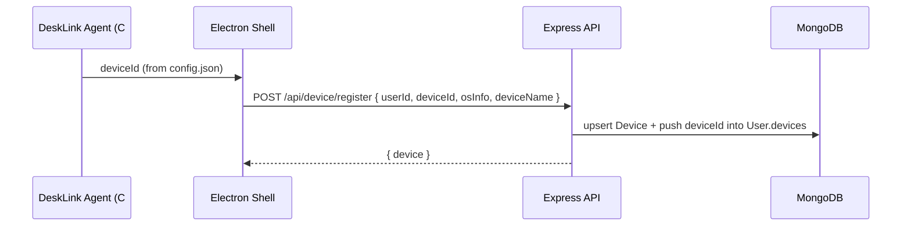
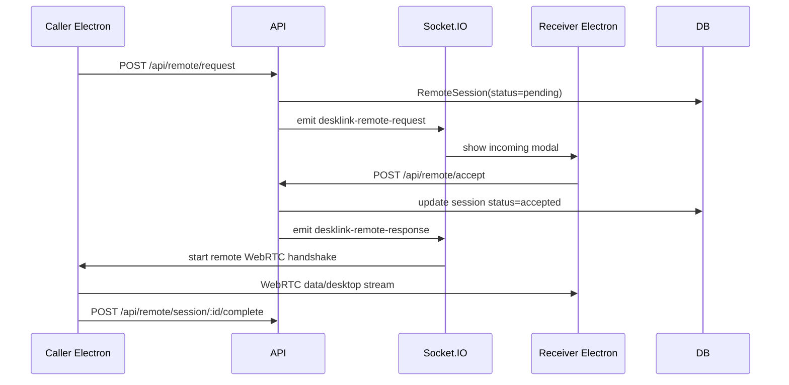

## DeskLink Backend & Agent Architecture

### 1. Device ID + User Linking



### 2. MongoDB Schemas

- `User`: fullName, email, password, `devices: [deviceId]`, `contacts: [{ contactUserId, savedName, contactDeviceId }]`.
- `Device`: `deviceId`, `userId`, `deviceName`, `osInfo`, `lastOnline`, `registeredAt`, `blocked`, `deleted`.
- `RemoteSession`: `sessionId`, caller/receiver user & device IDs, status (`pending|accepted|rejected|ended`), timestamps.
- `ContactLink`: `ownerUserId`, `contactUserId`, `contactDeviceId`, `aliasName`, `blocked`.

All schemas live in `backend/models`.

### 3. Remote Connection Flow



### 4. Electron ↔ Native Agent Bridge

The preload script exposes `window.deskLinkAgent` with:

- `getDeviceId()` → reads `%AppData%\DeskLinkAgent\config.json`.
- `startClientSession({ sessionId, receiverDeviceId })`
- `startHostSession({ sessionId, callerDeviceId })`

React front-end consumes these via `src/modules/desklink/utils/nativeBridge.js`.

### 5. Backend Routes

| Route | Description |
| --- | --- |
| `POST /api/device/register` | Upsert device record, update `lastOnline`, enforce block/soft-delete flags. |
| `PATCH /api/device/:deviceId/block` | Toggle `blocked`. |
| `DELETE /api/device/:deviceId` | Soft delete device. |
| `POST /api/contact-links` + `GET /api/contact-links` | Save contacts with device associations. |
| `POST /api/remote/request` | Create pending remote session. |
| `POST /api/remote/accept` \| `/reject` | Update session status and notify caller via Socket.IO. |
| `POST /api/remote/session/:id/complete` | Mark session ended. |

### 6. Security & Rate-Limiting

- All routes require `Authorization: Bearer <JWT>` (`protect` middleware).
- Device registration checks `req.user._id === userId` to avoid spoofing.
- Devices can be blocked per user; blocked devices cannot register or accept sessions.
- Soft delete ensures audit history.
- Recommended extras:
  - Add `express-rate-limit` on `/api/device/register` and `/api/remote/*`.
  - Store audit logs for session start/stop.
  - Rotate session IDs using `crypto.randomUUID`.

### 7. Sample API Responses

**POST /api/device/register**
```json
{
  "device": {
    "id": "65f3...",
    "deviceId": "DL-483-129",
    "deviceName": "Studio Workstation",
    "osInfo": "Windows 11 Pro (22635)",
    "lastOnline": "2025-02-01T10:15:25.445Z",
    "blocked": false,
    "deleted": false
  }
}
```

**POST /api/remote/request**
```json
{
  "session": {
    "sessionId": "65f3cd2f9d57c1ddf3f9e43b",
    "callerUserId": "65f3ca...",
    "receiverUserId": "65f3cb...",
    "callerDeviceId": "DL-483-129",
    "receiverDeviceId": "DL-774-221",
    "status": "pending",
    "startedAt": "2025-02-01T10:16:00.112Z"
  }
}
```

**POST /api/remote/accept**
```json
{
  "session": {
    "sessionId": "65f3cd2f9d57c1ddf3f9e43b",
    "status": "accepted",
    "receiverDeviceId": "DL-774-221"
  }
}
```

### 8. Rate-Limiting & Best Practices

1. Limit `/api/remote/request` to ~5/min per user to avoid spam.
2. Store `lastOnline` heartbeat from Electron every 30s to render live presence.
3. Encrypt any session negotiation payloads; never expose full JWTs to peer devices.
4. Validate `deviceId` strings (length, characters) before storing.
5. Use HTTPS + secure WebSocket (WSS) in production.


